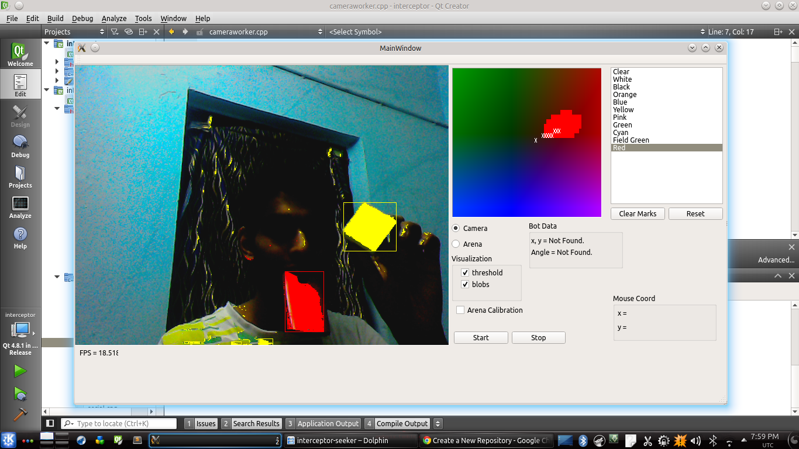

vision
======

A Cross-Platform Solution for fast image segmentation based tasks frequented in robotics.

# Features

* YUV cube based segmentation. Can choose custom contour for each colour. 3D-LUT implemented.
* Blob detection. One pass algorithm covers all blobs of all colors.
* Separate threads for:
	1. Color Calibration
	2. Video and Video processing (segmentation, blob detection)
	3. Algorithm (to be implemented by user)
	4. GUI 
* Allows different applications (eg. feature matching, lane following etc. ) to utilise a common calibration and GUI. Any arbitrary functionality may be added in the Algorithm class. A BeliefState class populates blob/segmentation data into the algorithm class.
 
